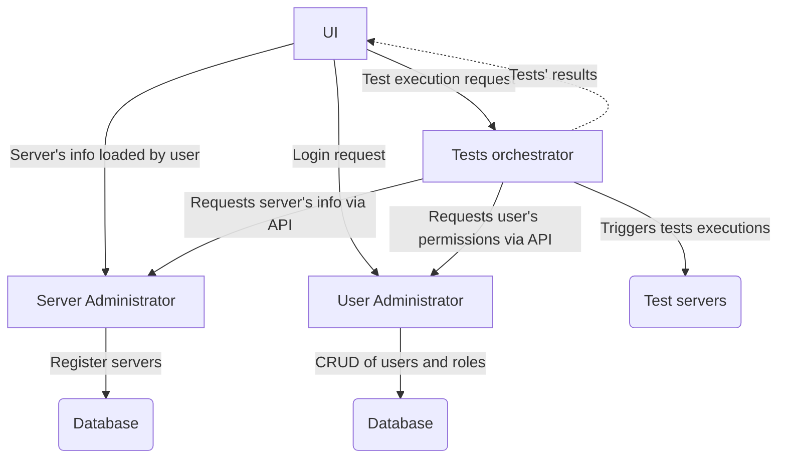

## Descripción del problema

En grandes empresas, muchos equipos de trabajo necesitan ejecutar pruebas en "hardware" con características específicas. Usualmente, no hay suficientes dispositivos para todas las personas, lo que requiere que los equipos compartan dispositivos. Esto puede llevar a tiempo de ocio o problemas de coordinación de los dispositivos. Algunos equipos utilizan herramientas como Jenkins para orquestar cargas de trabajo, pero Jenkins requiere infraestructura compleja y alto mantenimiento a nivel organizacional.

## Descripción de la propuesta

Una aplicación que orqueste las pruebas que todos los usuarios necesiten. Cuando el usuario ingrese la información del dispositivo en el cual se necesiten ejecutar las pruebas, proporcione el código fuente y el resultado esperado de las pruebas, entonces se enviará a un orquestador de pruebas que se encargará de ejecutar las pruebas en ese dispositivo. Después de que se ejecuten las pruebas, se enviará el resultado al usuario.

## Descripción de contextos

* **"Server Administrator"**: Recibirá la información del usuario que necesita ejecutar las pruebas, los datos necesarios para ejecutar las pruebas y buscará un servidor disponible para ejecutar las pruebas.
* **"User Administrator"**: Se encargará de permitirle al usuario autenticarse y cualquier información que necesiten los demás contextos para verificar que el usuario tenga permisos para realizar todas las solicitudes.
* **"Test orchestrator"**: Una vez que el usuario envíe los datos de las pruebas que necesita ejecutar, el orquestador seleccionará un dispositivo que cumpla con todas las características requeridas y ejecutará las pruebas en esos dispositivos.

## Justificación de división

Justificación de la división de contextos

Durante la división de contextos se tuvo en cuenta principalmente que todos los contextos posean una responsabilidad única y bien definida, que eventualmente puedan reutilizarse y se evitó realizar demasiadas divisiones, ya que se planea diseñar un producto mínimo viable.

* **"Server Administrator"**: Tiene sentido que sea un contexto aparte debido a que ningún otro contexto necesita modificar la información de los servidores. Eventualmente se podría reutilizar o expandir este contexto para implementar un sistema de control de inventarios.
* **"User Administrator"**: Dado que este contexto gestiona la seguridad del sistema, es recomendable que esté separado para seguir buenas prácticas de seguridad.
* **"Test orchestrator"**: Este contexto contiene la funcionalidad principal de la aplicación y se podría extender más, sin embargo debido a que se quiere diseñar un producto mínimo no se planea dividir más.

## Principales desafíos.

Implementar un sistema de mensajería que provea el resultado de las pruebas. Se contempla la posibilidad de utilizar mensajería asíncrona.
Soportar el despliegue de grandes aplicaciones.

